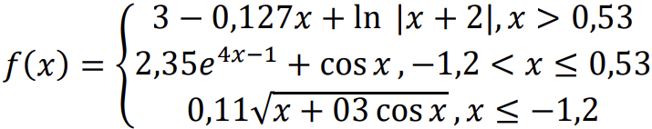

# Лабораторні роботи з ВКН

Тут представлені лабораторні роботи з предмету "Вступ до компʼютерних наук". Відомості про автора:

| Тип       | Значення                     |
|-----------|------------------------------|
| ПІБ       | Переверзєв Сергій Сергійович |
| Факультет | ФІТ                          |
| Група     | 1-8                          |

## Лабораторна №2

Створити гітхаб-репозиторій, зареєструватися на гітхабі та синхронізувати дані

## Лабораторна №3

Варіант 10.

1. Користувач задає два двоцифрових числа. Написати програму, яка обчислить суму цифр, з яких складаються ці числа.

2. Користувач задає довжину ребра куба. Програма повинна обчислити обʼєм і площу бічної поверхні цього куба.

## Лабораторна №4

Варіант 10
1. Написати програму для обчислення значення функції 
    > 𝑓(𝑥) = 3-𝑥 ∙ √|3,19𝑥| + log4 |𝑥 + 1| / (|𝑥 + 1| + 0,7).

2. Написати програму, яка обчислює значення виразу 
    > 𝑋 = √(𝑎 cos 𝑏 + 𝑒𝑐) + log7(2𝑥 + 4). 

## Лабораторна №5

Варіант 10
1. Написати програму, яка обчислюватиме значення функції у залежності
   від значення аргументу:
   
   

2. Точка М має координати (х; у). Користувач задає координати трьох
   точок: А, В, С на площині. Програма повинна вивести на екран назву точки,
   відстань від якої до точки М найбільша.

## Лабораторна №6

Варіант 10

Дано функцію: 
> 𝑓(𝑥) = 𝑥 / (2𝑥 + 𝑒𝑥)

1. Протабулювати функцію в діапазоні `[a; b]` з кроком `h` за допомогою циклу з параметром. Значення `a`, `b`, `h` вводяться з клавіатури.
2. Протабулювати функцію в діапазоні `[a; b]` з кроком `h` за допомогою циклу з передумовою. Значення `a`, `b`, `h` вводяться з клавіатури.
3. Записати всі значення функції у список. Відсортувати список за
   спаданням. Вивести список у несортованому і відсортованому вигляді на екран (у рядок).